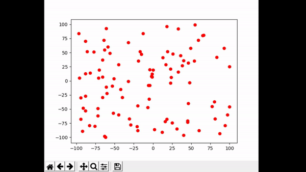
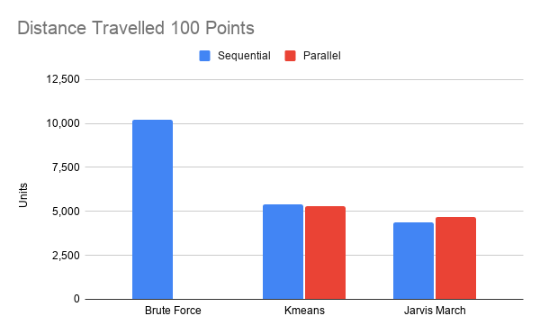
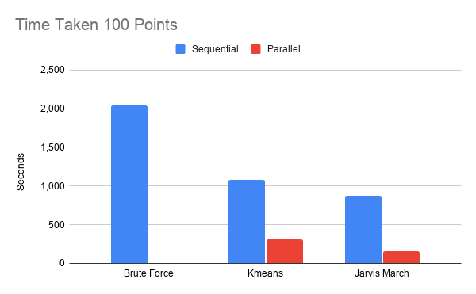
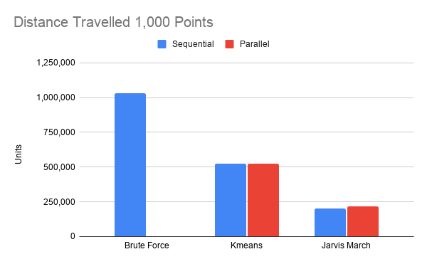
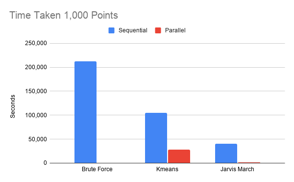
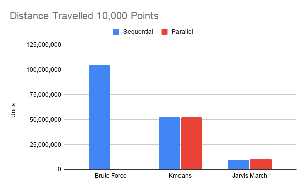
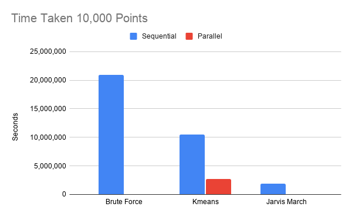

# Freeze Tag Robots - RIT CSCI-716: Computational Geometry - Final Project 
## Group Members
- John Tran (jxt5551@rit.edu)
- Brian Musliner (bcm7897@rit.edu)
- Brendan Mutton (bxm8164@rit.edu)

## Chosen Category
Category 2: Work on Open Problems in the Field

## Description
This project will be our approaches to the open “__Freeze-Tag Robot__” problem. 
We have implemented __brute force__, __Jarvis March__, and __KMeans clustering__ algorithm and a visualizer to demonstrate these different algorithms and their time complexity. These algorithms are inspired by the topics we have learned in our current and previous courses.

## Background Information    
From _Arkin, 2002_:
- Consider a set of n robots, modeled as points in some metric space
- Initially, there is one ‘awake’ robot and all others are asleep
- Goal is to ‘wake up’ all of the robots as quickly as possible
- To wake up a sleeping robot, an awake robot must go to its location
- Objective is to minimize the ‘makespan’, which is the time when the last robot is awakened

Similar to finding a spanning tree with maximum out-degree two that minimizes the radius from a fixed source (Problem 35). Another similar problem is the Travelling salesman problem (TSP). This can be seen when you look at our sequential approaches!

Most recently in _Arkin, 2006_:

They prove that the Freeze-Tag Problem is NP-hard, even for the case of star graphs with an equal number of robots at each vertex. There is an O(sqrt(log n))-approximation algorithm for the general Freeze-Tag Problem, in the context of the _bounded-degree minimum diameter spanning tree problem_. Although the results in _Arkin_ show tighter bounds for specific version of the Freeze-Tag Problem. General graphs and trees are O(sqrt(log n)), while greedy star is 7/3, and arbitrary stars are 14. Weighted star and geometric are 1 + epsilon, while Online is O(log delta).

#### Applications
- Distributed Systems: How to efficiently replicate data across multiple nodes if physical distance is a factor
- Activating sleeper cell spy agents
- Virus Transmission model

#### Author's Improvements

###### Density-Based Strategy
- First define a dense region of the domain
- Identify dense subtree T’ and activate it recursively
- O(1)-approximation for Euclidean spaces
- O((log n) ^log(5/3)) - approximation for unweighted graphs

###### Sibling-Based Strategy
- Have spanning tree T
- Each Robot that is awoken wakes its children

## Approaches

### Jarvis March Convex Subhulls
A solution we propose is called Jarvis March Convex Subhulls. This solution uses the Jarvis March algorithm to compute all the subhulls of a set of points. To do this the convex hull of the set of points is computed. Then all points that were part of the convex hull are removed from the set. Then the next convex hull is computed. This process is repeated until there are only 6 points left. Each subhull is saved to a list. This list of subhulls serves as a work order list. In the sequential version a single robot moves through the list of subhulls, waking up every robot along the way. 
The following GIF is the sequential version

In the parallel version when a robot is woken up, it checks the list of subhulls. If there is a subhull available, the robot will remove the subhull from the list and begin waking up all the robots in that subhull. This process continues until all the robots are awoken.

### KMeans Clustered Awakening
Another solution we propose is called KMeans Clustered Awakening. This solution uses the KMeans clustering algorithm with 4 clusters to cluster all the points in the set. Once the clusters have been determined the sequential version utilizes a single robot to move through every cluster and wake up every robot. The path the robot takes within the cluster is random based on the input order of the points. The following give shows the sequential version.

The parallel version, similar to Jarvis March Convex Subhulls, uses the list of clusters as work orders. A robot that is awoken will check to see if there are any available clusters. If there are it will move to wake up that cluster. The following GIF visualizes KMeans Clustered Awakening Parallel

## Complexity Analysis
Convex Subhull:

The most computationally taxing operation in the convex subhull solution was merging the subhulls, which had a time complexity of O(n) for the worst case. Thus, the time complexity for the convex subhull solution was found to be O(n) for the worst case,  such that n = number of robots. 

K-Means:

The time complexity for the k-means clustered awakening solution was found to be O(n * k * i) for the worst case, such that n = number of robots, k = number of centroids, and i = total iterations.

## Visualizer
Our visualizer helps to provide a meaningful demonstration of the implemented algorithms. You can see how the sequential algorithms take much more time to wake up all the robots. The visualizer is built using matplotlib and has the ability for us to step through the visualization at different speeds.

## Results

#### Distance Travelled 100 Points
|              | Sequential | Parallel |
|--------------|------------|----------|
| Brute Force  |     10,202 |          |
| Kmeans       |      5,419 |    5,312 |
| Jarvis March |      4,357 |    4,686 | 

#### Time Taken in seconds for 100 Points
|              | Sequential | Parallel |
|--------------|------------|----------|
| Brute Force  |      2,040 |          |
| Kmeans       |      1,083 |      314 |
| Jarvis March |        871 |      161 |

#### Distance Travelled 1,000 Points
|              | Sequential | Parallel |
|--------------|------------|----------|
| Brute Force  |  1,030,012 |          |
| Kmeans       |    523,112 |  522,269 |
| Jarvis March |    203,727 |  218,698 |

#### Time Taken in seconds for 1,000 Points
|              | Sequential | Parallel |
|--------------|------------|----------|
| Brute Force  |    212,002 |          |
| Kmeans       |    104,622 |   27,713 |
| Jarvis March |     40,745 |    1,528 |

#### Distance Travelled 10,000 Points
|              | Sequential  | Parallel   |
|--------------|-------------|------------|
| Brute Force  | 104,521,104 |            |
| Kmeans       |  52,315,254 | 52,322,947 |
| Jarvis March |   9,581,006 | 10,598,284 |

#### Time Taken in seconds for 10,000 Points
|              | Sequential | Parallel  |
|--------------|------------|-----------|
| Brute Force  | 20,904,220 |           |
| Kmeans       | 10,463,050 | 2,675,462 |
| Jarvis March |  1,916,201 |    17,628 |

## Conclusion
Our results show that the distance traveled by the robots is not significantly different between sequential and parallel despite the differences in approaches. The KMeans Clustered Awakening and Jarvis March Convex Subhulls both had very similar distance traveled between their sequential and parallel version. This tells us that even though there are more robots moving to wake up other robots the overall distance traveled by them does not increase or decrease by any significant amount. However, the parallel versions wake up their set of robots significantly faster. Particularly the Jarvis March parallel version. This is because each subhull is awoken by another robot and the amount of subhulls scales with the input dataset. The more points there are in the dataset the more convex subhulls there are. This means that Convex Subhulls scales very well with larger input sets. 

We also note that the time taken for KMeans robots to wake up is significantly higher than Jarvis March at 10,000 points despite being almost equal at 100 points. This is caused by the unordered nature of the KMeans clusters. Each point in the cluster is random whereas each point in the subhull is ordered counter-clockwise. This means that Jarvis March has significantly less overall distance to cover due to its more optimal pathing.

## Challenges
Implementing all of the different algorithms presented interesting challenges. The visualizations and evaluations had to be constructed in different ways. In order for the visual order of the points to be plotted correctly it had to be processed in a distinct way than the evaluation method that doesn't care about plotting order. Learning all of the different algorithms and implementing both sequential and parallel versions was difficult. 

## Future Work
There are several inefficiencies with our implementation that could be improved. The points within the KMeans Clusters are not ordered and the path robots take to wake them up is very inefficient. Applying A* to the clusters to find the most efficient path would provide significant performance improvements. Additionally, the number of KMeans Clusters currently do not scale with data size input, there are only ever 4 clusters. Creating a system to dynamically determine the optimal number of clusters would also provide significant performance improvements, particularly in the parallel version. 

Right now each robot is assigned a job, either a subhull or a cluster. If an algorithm that was created to allow all robots to wake up any other robot without the use of these jobs would provide performance improvements. In our implementation if a robot is awoken and there are no more available jobs it will just sit idle. If there was a way to allow the robots to break up the jobs and allow robots to wake up other robots in the middle of the cluster or subhull would allow the entire set to be awoken faster.

## References
Arkin, E., Bender, M., Fekete, S. et al. The Freeze-Tag Problem: How to Wake Up a Swarm of 
Robots. Algorithmica 46, 193–221 (2006). 

Arkin, E., Bender, M., & Ge, D. (2003). Improved Approximation Algorithms for the Freeze-Tag 
Problem. In Proceedings of the Fifteenth Annual ACM Symposium on Parallel 
Algorithms and Architectures (pp. 295–303). Association for Computing Machinery.

Problem 35: Freeze-Tag: Optimal Strategies for Awakening a Swarm of Robots. (n.d.). Retrieved 
September 07, 2020, from http://cs.smith.edu/~jorourke/TOPP/P35.html

Arkin, E., Bender, M., Fekete, S., Mitchell, J., & Skutella, M. (2002). The Freeze-Tag
Problem: How to Wake up a Swarm of Robots. In Proceedings of the Thirteenth Annual
ACM-SIAM Symposium on Discrete Algorithms (pp. 568–577). Society for Industrial
and Applied Mathematics.
