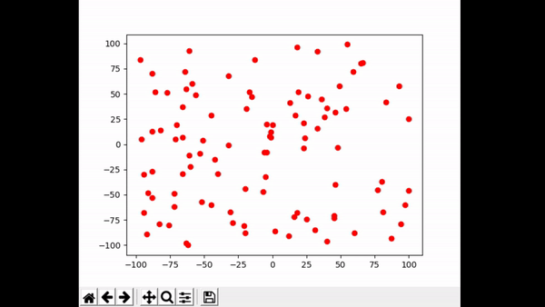

# Freeze-Tag-Robots
Different algorithms for the "Freeze-Tag Problem: How to Wake Up a Swarm of Robots" and a visualizer to demonstrate the different algorithms.

**Jarvis March Convex Subhulls**
A solution we propose is called Jarvis March Convex Subhulls. This solution uses the Jarvis March algorithm to compute all the subhulls of a set of points. 
To do this the convex hull of the set of points is computed. Then all points that were part of the convex hull are removed from the set. Then the next convex hull is computed.
This process is repeated until there are only 6 points left. Each subhull is saved to a list. This list of subhulls serves as a work order list. 
In the sequential version a single robot moves through the list of subhulls, waking up every robot along the way. 
The following GIF is the sequential version

In the parallel version when a robot is woken up, it checks the list of subhulls. If there is a subhull available, the robot will remove the subhull from the list and begin waking up all the robots in that subhull.
This process continues until all the robots are awoken.

**KMeans Clustered Awakening**
Another solution we propose is called KMeans Clustered Awakening. This solution uses the KMeans clustering algorithm to cluster all the points in the set.
Once the clusters have been determined the sequential version utilizes a single robot to move through every cluster and wake up every robot. 
The path the robot takes within the cluster is random based on the input order of the points. The following give shows the sequential version

The parallel version, similar to Jarvis March Convex Subhulls, uses the list of clusters as work orders. A robot that is awoken will check to see if there are any available clusters.
If there are it will move to wake up that cluster. The following GIF visualizes KMeans Clustered Awakening Parallel

