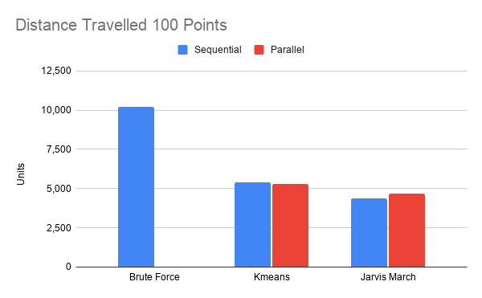
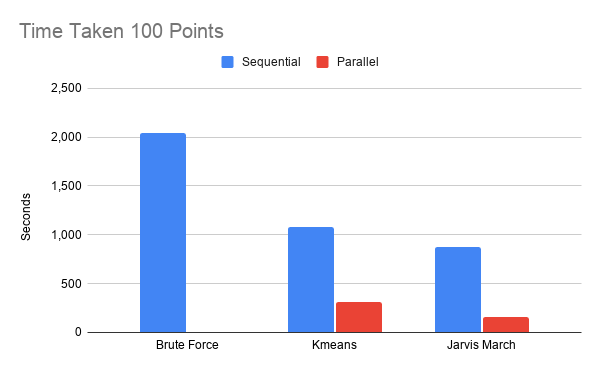
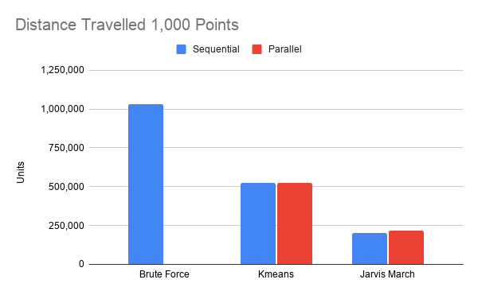
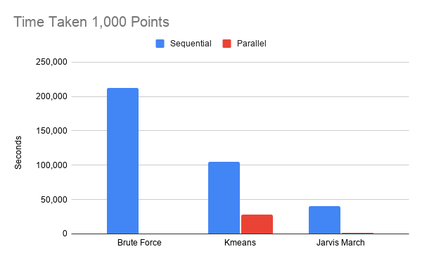
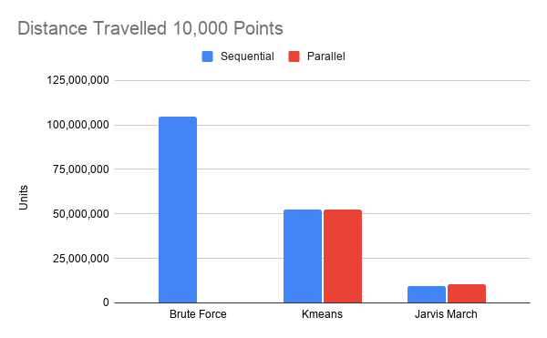

# Freeze Tag Robots - RIT CSCI-716: Computational Geometry - Final Project 
## Group Members
- John Tran (jxt5551@rit.edu)
- Brian Musliner (bcm7897@rit.edu)
- Brendan Mutton (bxm8164@rit.edu)

## Chosen Category
Category 2: Work on Open Problems in the Field

## Description
This project will be our approaches to the open “__Freeze-Tag Robot__” problem. We have implemented __brute force__, __Jarvis March__, and __KMeans clustering__ algorithm and a visualizer to demonstrate these different algorithms and their time complexity. These algorithms are inspired by the topics we have learned in our current and previous courses.

## Background Information
    Background information about the problem. What is the current best known algorithm? What are the proven theoretical bounds on the problem?
    
From Arkin, 2002:
- Consider a set of n robots, modeled as points in some metric space
- Initially, there is one ‘awake’ robot and all others are asleep
- Goal is to ‘wake up’ all of the robots as quickly as possible
- To wake up a sleeping robot, an awake robot must go to its location
- Objective is to minimize the ‘makespan’, which is the time when the last robot is awakened

Similar to finding a spanning tree with maximum out-degree two that minimizes the radius from a fixed source (Problem 35)

#### Applications
- Distributed Systems: How to efficiently replicate data across multiple nodes if physical distance is a factor
- Activating sleeper cell spy agents
- Virus Transmission model

#### Author's Improvements

###### Density-Based Strategy
- First define a dense region of the domain
- Identify dense subtree T’ and activate it recursively
- O(1)-approximation for Euclidean spaces
- O((log n) ^log(5/3)) - approximation for unweighted graphs

###### Sibling-Based Strategy
- Have spanning tree T
- Each Robot that is awoken wakes its children

## Application Domain
    If you have an application domain problem:

    Background information about the problem.

    What are your specific inputs and outputs (show a visualization, if possible).
    
Set of randomly placed robots, output is distance and time it took to wake up all the robots.

    What are the needs for the problem domain -- is it important that you find the optimal solution? why or why not?

    Are there related projects by others that tackle the same problem. How?
    
Travelling salesman?

## Approaches
    What approaches have you tried? Can you visualize the results? Show sketches of where proof attempts have failed, or example point sets where your (mostly good) algorithm has a bad case?

### Jarvis March Convex Subhulls
A solution we propose is called Jarvis March Convex Subhulls. This solution uses the Jarvis March algorithm to compute all the subhulls of a set of points. 
To do this the convex hull of the set of points is computed. Then all points that were part of the convex hull are removed from the set. Then the next convex hull is computed.
This process is repeated until there are only 6 points left. Each subhull is saved to a list. This list of subhulls serves as a work order list. 
In the sequential version a single robot moves through the list of subhulls, waking up every robot along the way. 
The following GIF is the sequential version

In the parallel version when a robot is woken up, it checks the list of subhulls. If there is a subhull available, the robot will remove the subhull from the list and begin waking up all the robots in that subhull.
This process continues until all the robots are awoken.

### KMeans Clustered Awakening
Another solution we propose is called KMeans Clustered Awakening. This solution uses the KMeans clustering algorithm to cluster all the points in the set.
Once the clusters have been determined the sequential version utilizes a single robot to move through every cluster and wake up every robot. 
The path the robot takes within the cluster is random based on the input order of the points. The following give shows the sequential version

The parallel version, similar to Jarvis March Convex Subhulls, uses the list of clusters as work orders. A robot that is awoken will check to see if there are any available clusters.
If there are it will move to wake up that cluster. The following GIF visualizes KMeans Clustered Awakening Parallel

## Complexity Analysis
    Give a complexity analysis of your algorithm, and also show measured running time for different sizes of inputs 

## Visualizer
Our visualizer helps to provide a meaningful demonstration of the implemented algorithms. You can see how the sequential algorithms take much more time to wake up all the robots.

## Results

#### Distance Travelled 100 Points
|              | Sequential | Parallel |
|--------------|------------|----------|
| Brute Force  |     10,202 |          |
| Kmeans       |      5,419 |    5,312 |
| Jarvis March |      4,357 |    4,686 | 

#### Time Taken in seconds for 100 Points
|              | Sequential | Parallel |
|--------------|------------|----------|
| Brute Force  |      2,040 |          |
| Kmeans       |      1,083 |      314 |
| Jarvis March |        871 |      161 |

#### Distance Travelled 1,000 Points
|              | Sequential | Parallel |
|--------------|------------|----------|
| Brute Force  |  1,030,012 |          |
| Kmeans       |    523,112 |  522,269 |
| Jarvis March |    203,727 |  218,698 |

#### Time Taken in seconds for 1,000 Points
|              | Sequential | Parallel |
|--------------|------------|----------|
| Brute Force  |    212,002 |          |
| Kmeans       |    104,622 |   27,713 |
| Jarvis March |     40,745 |    1,528 |

#### Distance Travelled 10,000 Points
|              | Sequential  | Parallel   |
|--------------|-------------|------------|
| Brute Force  | 104,521,104 |            |
| Kmeans       |  52,315,254 | 52,322,947 |
| Jarvis March |   9,581,006 | 10,598,284 |

#### Time Taken in seconds for 10,000 Points
|              | Sequential | Parallel  |
|--------------|------------|-----------|
| Brute Force  | 20,904,220 |           |
| Kmeans       | 10,463,050 | 2,675,462 |
| Jarvis March |  1,916,201 |    17,628 |

## Conclusion

## Challenges

## Future Work

## References
Arkin, E., Bender, M., Fekete, S. et al. The Freeze-Tag Problem: How to Wake Up a Swarm of 
Robots. Algorithmica 46, 193–221 (2006). 

Arkin, E., Bender, M., & Ge, D. (2003). Improved Approximation Algorithms for the Freeze-Tag 
Problem. In Proceedings of the Fifteenth Annual ACM Symposium on Parallel 
Algorithms and Architectures (pp. 295–303). Association for Computing Machinery.

Problem 35: Freeze-Tag: Optimal Strategies for Awakening a Swarm of Robots. (n.d.). Retrieved 
September 07, 2020, from http://cs.smith.edu/~jorourke/TOPP/P35.html

Arkin, E., Bender, M., Fekete, S., Mitchell, J., & Skutella, M. (2002). The Freeze-Tag
Problem: How to Wake up a Swarm of Robots. In Proceedings of the Thirteenth Annual
ACM-SIAM Symposium on Discrete Algorithms (pp. 568–577). Society for Industrial
and Applied Mathematics.
